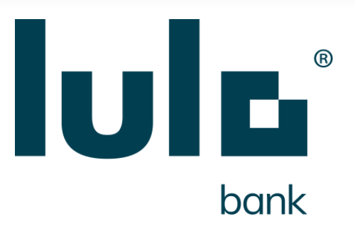

<p align="left">
    <a href="https://www.lulobank.com" rel="noopener">
    </a>
</p>

# credits-business-capability

> <b>¡Logos microservice ownership!</b>

> @jorgetovar @agutierrez-lulo @jperezlulo @victor-mejia 


---
## 🧐 About <a name="about"></a>

Loans microservice for creation Wizard and loan administration

## 📝 Table of Contents

> If your `README` has a lot of info, section headers might be nice.

- [Installation](#installation)
- [Features](#features)
- [Support](#support)
- [License](#license)


## ⚙️ Installation <a name="installation"></a>

- All the `code` required to get started
- Images of what it should look like

### 📦 Setup

- Run for dev purposes:

```shell
$ >gradle bootRun --args='--spring.profiles.active=sandbox'

cd it-python
python3 -m unittest accept_offer_test.py
```

- For all the possible languages that support syntax highlithing on GitHub (which is basically all of them), refer <a href="https://github.com/github/linguist/blob/master/lib/linguist/languages.yml" target="_blank">here</a>.

---

## 💡 Features <a name="features"></a>
### Usage
### Documentation
### Tests

- Going into more detail on code and technologies used
- I utilized this nifty <a href="https://github.com/adam-p/markdown-here/wiki/Markdown-Cheatsheet" target="_blank">Markdown Cheatsheet</a> for this sample `README`.

---

## 🙋 Support <a name="support"></a>

- Website at <a href="http://www.lulobank.com" target="_blank">`lulobank.com`</a>

---

## 📝 License  <a name="license"></a>

<a href="http://www.lulobank.com" target="_blank">Lulobank</a>.

